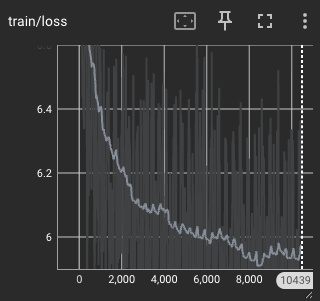
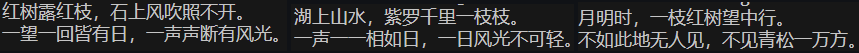

# 第六章 循环神经网络：唐诗生成实验报告

2251174 ｜ 付沐鑫

## 一、RNN、LSTM 与 GRU 模型简介

### 1. 循环神经网络（RNN）

循环神经网络是一类专门处理**序列数据**的模型。与把输入看成独立样本的前馈网络不同，RNN 在每个时间步接收当前输入 $x_t$ 与**上一步的隐状态** $h_{t-1}$，通过同一套参数更新隐状态：

$$
h_t = \tanh(W_{xh} x_t + W_{hh} h_{t-1} + b_h)
$$

其中 $h_t$ 可看作对「从开始到当前时刻」信息的压缩表示。输出可由 $h_t$ 再经线性层得到。RNN 的优点是参数量不随序列长度增长，适合语言、语音等顺序任务；缺点是**长序列上易出现梯度消失或爆炸**，难以记住很久之前的上下文。

### 2. 长短期记忆网络（LSTM）

LSTM 在 RNN 基础上引入**细胞状态** $c_t$ 与**门控机制**，显式区分「长期记忆」与「当前输入」。典型结构包括：

- **遗忘门** $f_t$：决定从 $c_{t-1}$ 中丢弃多少信息；
- **输入门** $i_t$ 与候选 $\tilde{c}_t$：决定写入细胞状态的新内容；
- **输出门** $o_t$：决定从 $c_t$ 中读出多少信息到隐状态 $h_t$。

通过 sigmoid 与逐元素乘积，LSTM 能更有选择地**保留长期依赖、过滤噪声**，在机器翻译、文本生成等任务中比朴素 RNN 更稳定。本实验 PyTorch 代码中采用**两层 LSTM**（`num_layers=2`），浅层提取局部模式，深层组合更高层语义，再用于预测下一个汉字。

### 3. 门控循环单元（GRU）

GRU 可视为 LSTM 的简化：将遗忘门与输入门合并为**更新门** $z_t$，并保留**重置门** $r_t$ 控制对历史信息的利用程度。状态更新通常写为：

$$
h_t = (1 - z_t) \odot h_{t-1} + z_t \odot \tilde{h}_t
$$

其中 $\tilde{h}_t$ 由当前输入与「经重置门过滤后的历史」共同决定。GRU 参数量一般少于同规模的 LSTM，训练往往更快，在许多序列任务上与 LSTM 效果接近。本作业主程序以 LSTM 实现诗歌生成；若在其它框架中换用 GRU，整体流程（嵌入 → 循环层 → 全连接分类）仍一致。

---

## 二、诗歌生成过程

本实验（`tangshi_for_pytorch`）将**整首唐诗视为字符序列**，做**字符级语言模型**：给定已出现的字，预测**下一个字**的概率分布。模型结构可概括为：

1. **词嵌入（`word_embedding`）**  
   将每个汉字（及起止符号 `G`、`E`）的编号映射为固定维度的稠密向量（如 100 维），作为循环网络的输入特征。

2. **双层 LSTM（`self.rnn_lstm`）**  
   输入张量形状为 `(batch, seq_len, embedding_dim)`。LSTM 沿时间步依次处理每个字的向量，隐状态携带「前文语境」。初始隐状态与细胞状态默认为零，表示从无上下文开始。

3. **全连接层与输出（`fc` + `ReLU` + `LogSoftmax`）**  
   每个时间步的隐状态经线性层映射到**词表大小**的维度，再经 `LogSoftmax` 得到对数概率，与 `NLLLoss` 配合完成多分类训练。

**训练阶段**（`is_test=False`）：对一整句诗，从第一个字到最后一个字，**每个位置**都产生一个「下一个字」的预测，与右移一位的标签序列对齐，计算平均负对数似然并反向传播，使网络学会押韵、句式与常见搭配等统计规律。

**生成阶段**（`is_test=True`）：给定开头字（如题目要求的「日、红、山、夜、湖、海、月」等），将当前已生成字符串编码为 id 序列送入网络；只取**最后一个时间步**的 `LogSoftmax` 输出（即「在读完当前整段前缀后，下一个字」的分布），用 `argmax`（或采样）得到下一个字，拼接到前缀后重复，直到出现结束符 `E` 或达到最大长度。这一过程称为**自回归生成**：每一步的输入都依赖上一步的输出，与训练时「用历史预测下一字」的目标一致。

综上，诗歌生成在结构上是「嵌入 → 双层 LSTM 编码上下文 → 线性层在词表上分类」；在流程上是「训练时整句多步监督学习下一字分布，推理时从指定首字出发逐步贪心（或采样）续写」。

---

## 三. 诗歌生成
RNN 训练曲线如下:

 

生成诗歌结果如图:

